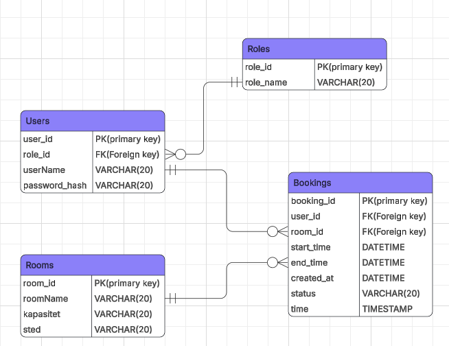

# BookingSystem – Oppsett av prosjekt

## ER-Diagram


## Databaseoppsett

Prosjektet bruker MySQL som database. Først ble databasen opprettet lokalt i MySQL.

```
CREATE TABLE Roles (
    role_id INT PRIMARY KEY AUTO_INCREMENT,
    role_name VARCHAR(20) NOT NULL
);

CREATE TABLE Users (
    user_id INT PRIMARY KEY AUTO_INCREMENT,
    role_id INT,
    userName VARCHAR(20),
    password_hash VARCHAR(255),
    FOREIGN KEY (role_id) REFERENCES Roles(role_id)
);

CREATE TABLE Rooms (
    room_id INT PRIMARY KEY AUTO_INCREMENT,
    roomName VARCHAR(20),
    kapasitet VARCHAR(20),
    sted VARCHAR(20)
);

CREATE TABLE Bookings (
    booking_id INT PRIMARY KEY AUTO_INCREMENT,
    user_id INT,
    room_id INT,
    start_time DATETIME,
    end_time DATETIME,
    created_at DATETIME DEFAULT CURRENT_TIMESTAMP,
    status VARCHAR(20),
    FOREIGN KEY (user_id) REFERENCES Users(user_id),
    FOREIGN KEY (room_id) REFERENCES Rooms(room_id)
);
```


## Installerte pakker

Følgende NuGet-pakker ble installert i prosjektet:

* Microsoft.EntityFrameworkCore (9.0.0)
* Pomelo.EntityFrameworkCore.MySql (9.0.0)
* Microsoft.EntityFrameworkCore.Design (9.0.0)


## Migrasjoner
Første migrasjon ble opprettet med:
```
dotnet ef migrations add InitialCreate
dotnet ef database update
```

## Seed Data

### Roller
To roller ble lagt til i databasen:
- Admin
- User

Dette ble gjort med:
```
dotnet ef migrations add SeedRoles
dotnet ef database update
```

### Brukere
To testbrukere ble seedet for videre utvikling av autentisering:
*Admin-bruker*
- UserName: admin
- PasswordHash: admin123!
- RoleId: 1

*Standard bruker*
- UserName: user
- PasswordHash: user123!
- RoleId: 2

PasswordHash-feltet ble samtidig oppdatert til VARCHAR(255) for å støtte hashing senere.

Dette ble gjort med:
```
dotnet ef migrations add SeedUsers
dotnet ef database update
```

## Utviklingsmiljø
Resten av prosjektet ble utviklet i Visual Studio Code med ASP.NET Core.

## Git-arbeidsflyt
Prosjektet bruker Git og GitHub for versjonskontroll.

Egen branch ble opprettet for videre databasearbeid:
```
git checkout -b ikram-dev
```
Endringer pushes til egen branch før eventuell merge til main.
